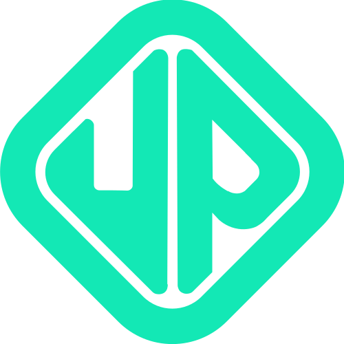

<a href="https://community.upvision.co">
  <p align="center">
      
  </p>
  <h1 align="center">
    Upvision Community Front-End
  </h1>
</a>

## :rocket: Tech Stack

- ReactJs
- NextJs
- Storybook
- PostCSS
- NodeJs
- Express
- MongoDB
- Mongoose

## :warning: Prerequisite

- node
- npm
- mongodb

## :cd: How to run local

```bash
# Clone this repository
$ git clone https://github.com/Upvision/community-front-end

# Go into the repository
$ cd community-front-end

# On another terminal, go to the client folder
$ cd client

# Install dependencies
$ npm install

# Use the command below for Android devices
$ npm run dev

# To see the incomplete storybook components
npm run storybook
```

## :mag_right: Testing

Make sure mongodb is running before testing the server.

```bash
$ cd server
$ yarn test
```

<sub>There are missing tests on the server side and there are no tests on the client side yet.</sub>

## :scroll: Todo

- [ ] Add missing components to storybook
- [ ] Complete missing server tests
- [ ] Add text editor for post

## :memo: License

This project is made available under the MIT License.
